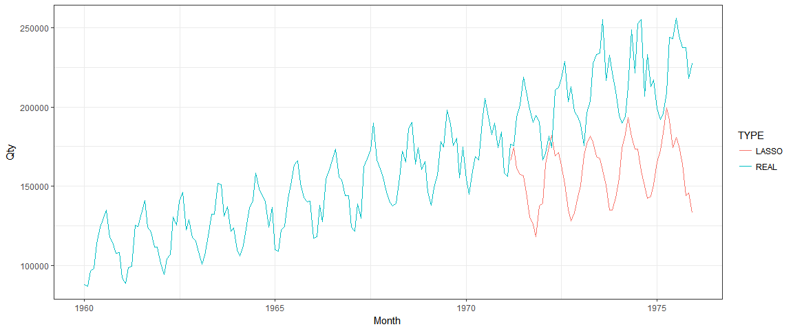

README
================

GitHub Documents
----------------

Test messages

데이터 불러오기
---------------

``` r
df <- loadData(2)
```

train / test 셋 나누기
----------------------

``` r
train_id <- 1:floor(nrow(df)*0.7)
df_train <- df[train_id,]
df_test <- df[-train_id,]
```

모델 생성
---------

``` r
df_train_f <- generateFeatures(ts=df_train$Qty, len_wdw = 4, seasonal=c(4,6))
```

    ## 
    ## Attaching package: 'purrr'

    ## The following objects are masked from 'package:foreach':
    ## 
    ##     accumulate, when

    ## 
    ## Attaching package: 'zoo'

    ## The following objects are masked from 'package:base':
    ## 
    ##     as.Date, as.Date.numeric

``` r
cv.fit <- cv.glmnet(df_train_f$X, df_train_f$y, alpha = 1)
fit <-glmnet(df_train_f$X, df_train_f$y, alpha = 1, lambda=cv.fit$lambda.min)
```

예측
----

``` r
pred <- rollingPredict(ts = df_train$Qty, fcst_h = nrow(df_test), model = fit, len_wdw = 4, seasonal=c(4,6))
```

성능확인
--------

``` r
mape(pred, df_test$Qty)
```

    ## [1] 23.85328

예측 결과 시각화
----------------

``` r
df%>%
  mutate(TYPE="REAL")%>%
  union_all(
    data.frame(Month=df_test$Month, Qty=pred)%>%
      mutate(TYPE="LASSO"))%>%
  ggplot(., aes(x=Month, y=Qty, color=TYPE))+
  geom_line()+
  theme_bw()
```


